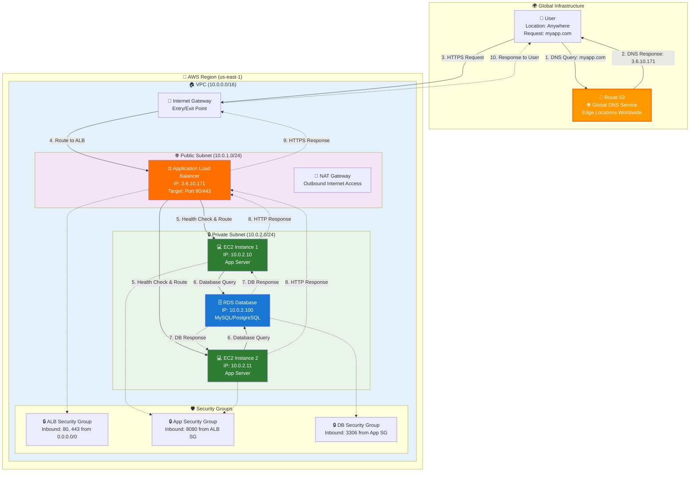

# Route 53 in AWS Architecture - Complete Infrastructure

## AWS Architecture with Route 53

```mermaid
architecture-beta
    group internet(cloud)[Internet]
    group aws_region(logos:aws)[AWS Region]
    group vpc(logos:aws-vpc)[VPC]
    group public_subnet(logos:aws-ec2)[Public Subnet]
    group private_subnet(logos:aws-ec2)[Private Subnet]
    group route53_global(logos:aws-route-53)[Route 53 Global]

    service user(logos:aws-cloudfront)[User] in internet
    service dns_service(logos:aws-route-53)[DNS Service] in route53_global
    service igw(logos:aws-internet-gateway)[Internet Gateway] in vpc
    service alb(logos:aws-elastic-load-balancing)[Application Load Balancer] in public_subnet
    service nat(logos:aws-nat-gateway)[NAT Gateway] in public_subnet
    service app1(logos:aws-ec2)[App Server 1] in private_subnet
    service app2(logos:aws-ec2)[App Server 2] in private_subnet
    service rds(logos:aws-rds)[RDS Database] in private_subnet

    user:R --> L:dns_service
    dns_service:B --> T:igw
    igw:B --> T:alb
    alb:B --> T:app1
    alb:B --> T:app2
    app1:R --> L:rds
    app2:R --> L:rds
```

## Detailed Request Flow

**AWS Route 53 Integration Points**:

1. **Global Service**: Route 53 operates outside of any specific region
2. **Edge Network**: Uses AWS CloudFront edge locations for fast DNS resolution
3. **VPC Integration**: Resolves to resources within your VPC (ALB, NLB, etc.)
4. **Security**: Works with Security Groups and NACLs for network security
5. **High Availability**: Automatically handles multi-AZ deployments

**Key Benefits in AWS Architecture**:
- 🚀 **Low Latency**: DNS resolution from nearest edge location
- 🔒 **Security**: Integrates with AWS IAM and CloudTrail
- 📊 **Monitoring**: CloudWatch metrics and Route 53 health checks
- 🔄 **Automation**: Works with AWS CloudFormation and Terraform