# AWS Route 53 Overview

## DNS as a Service

```mermaid
flowchart TD
    A["👤 User"] --> B["🌐 Domain Name<br/>(amazon.com)"]
    B --> C["☁️ AWS Route 53<br/>DNS as a Service"]
    C --> D["🔢 IP Address<br/>(3.6.10.171)"]
    D --> E["🖥️ Web Server"]
    
    style A fill:#e1f5fe
    style B fill:#f3e5f5
    style C fill:#fff3e0
    style D fill:#e8f5e8
    style E fill:#fce4ec
    
    classDef highlight fill:#ffeb3b,stroke:#f57f17,stroke-width:3px
    class C highlight
```

**Key Concept**: Route 53 provides DNS (Domain Name System) as a managed service, just like how EC2 provides compute as a service.

**Function**: Maps human-readable domain names to machine-readable IP addresses.