# Route 53 Health Checks & Failover

## Intelligent Traffic Routing

```mermaid
flowchart TD
    subgraph Users ["👥 Users"]
        U1["👤 User 1"]
        U2["👤 User 2"] 
        U3["👤 User 3"]
    end
    
    subgraph R53Health ["☁️ Route 53 Health Monitoring"]
        Monitor["💓 Health Check Service<br/>Checks every 1-5 minutes"]
        Decision{"🤔 Server Status<br/>Assessment"}
    end
    
    subgraph Servers ["🖥️ Web Servers"]
        S1["🟢 Server 1<br/>US-East<br/>Status: Healthy<br/>Response: 200 OK"]
        S2["🔴 Server 2<br/>US-West<br/>Status: Unhealthy<br/>Response: Timeout"]
        S3["🟢 Server 3<br/>EU-West<br/>Status: Healthy<br/>Response: 200 OK"]
    end
    
    subgraph Routing ["🎯 Smart Routing Logic"]
        Route["📍 Route Traffic Only<br/>to Healthy Servers"]
    end
    
    Users --> R53Health
    Monitor --> S1
    Monitor --> S2  
    Monitor --> S3
    
    S1 -->|"✅ Healthy"| Decision
    S2 -->|"❌ Unhealthy"| Decision
    S3 -->|"✅ Healthy"| Decision
    
    Decision --> Route
    
    Route -->|"✅ Allow Traffic"| S1
    Route -.->|"❌ Block Traffic"| S2
    Route -->|"✅ Allow Traffic"| S3
    
    U1 --> S1
    U2 --> S3
    U3 --> S1
    
    style S1 fill:#4caf50,color:white
    style S2 fill:#f44336,color:white
    style S3 fill:#4caf50,color:white
    style Monitor fill:#ffeb3b
    style Route fill:#2196f3,color:white
```

**Health Check Features**:
- **Automatic Monitoring**: Checks server health every 1-5 minutes
- **Multiple Protocols**: HTTP, HTTPS, TCP health checks
- **Global Coverage**: Health checks from multiple AWS regions
- **Intelligent Failover**: Automatically routes traffic away from unhealthy servers
- **Real-time Updates**: DNS records updated based on health status