# Complete Route 53 Workflow

## End-to-End DNS Resolution Process

```mermaid
sequenceDiagram
    participant User as 👤 User
    participant Browser as 🌐 Browser
    participant R53 as ☁️ Route 53
    participant HostedZone as 📁 Hosted Zone
    participant HealthCheck as 💓 Health Check
    participant LB as ⚖️ Load Balancer
    participant App as 🖥️ Application

    Note over User,App: Complete DNS Resolution & Request Flow
    
    User->>Browser: Types "amazon.com"
    Browser->>R53: DNS Query: "What is amazon.com?"
    
    R53->>HostedZone: Look up DNS records
    HostedZone-->>R53: A Record: amazon.com → 3.6.10.171
    
    R53->>HealthCheck: Check server health
    HealthCheck-->>R53: Status: Healthy ✅
    
    R53-->>Browser: DNS Response: 3.6.10.171
    Browser->>LB: HTTP Request to 3.6.10.171
    LB->>App: Forward request to application
    App-->>LB: Application response
    LB-->>Browser: HTTP Response
    Browser-->>User: Display webpage
    
    Note over User,App: If server was unhealthy, Route 53 would return different IP
```

**Workflow Steps**:
1. **User Input**: User types domain name in browser
2. **DNS Query**: Browser asks Route 53 for IP address
3. **Record Lookup**: Route 53 checks hosted zone for DNS records
4. **Health Check**: Verifies target server is healthy
5. **DNS Response**: Returns IP address of healthy server
6. **HTTP Request**: Browser makes request to returned IP
7. **Load Balancing**: Load balancer distributes request
8. **Application Response**: App processes and responds
9. **User Experience**: Page loads successfully