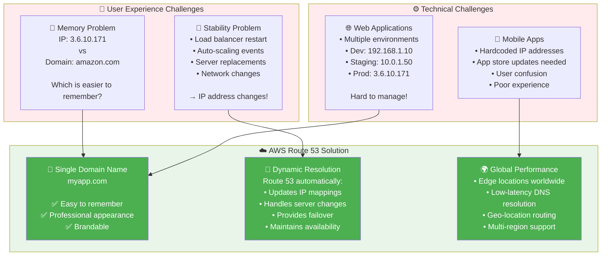

# Why Domain Names are Essential - AWS Perspective

## Problem vs Solution Architecture

```mermaid
architecture-beta
    group problems(logos:aws-x-ray)[Problems with IP Addresses]
    group solution(logos:aws-route-53)[DNS Solution]
    
    service memory_issue(logos:aws-application-discovery-service)[Hard to Remember] in problems
    service stability_issue(logos:aws-config)[IP Changes] in solution
    service dns_resolver(logos:aws-route-53)[Route 53 DNS] in solution
    service stable_access(logos:aws-global-accelerator)[Stable Access] in solution
    
    memory_issue:R --> L:dns_resolver
    stability_issue:R --> L:stable_access
```

## Detailed Problem Analysis

**Real-World AWS Scenarios**:

1. **Auto Scaling Groups**: When EC2 instances terminate/launch, IPs change
2. **Load Balancer Updates**: ALB/NLB replacements change endpoints
3. **Multi-AZ Deployments**: Failover between availability zones
4. **Blue/Green Deployments**: Switch between different infrastructure sets

**Route 53 Benefits**:
- ✅ **User-Friendly**: Memorable domain names instead of IP addresses
- ✅ **Infrastructure Agnostic**: Same domain works across different AWS resources
- ✅ **Automated Updates**: DNS records update automatically with infrastructure changes
- ✅ **Global Reach**: Works consistently worldwide via AWS edge network