# Why Domain Names are Essential - AWS Perspective

## Problem vs Solution Architecture

## Detailed Problem Analysis

```mermaid
flowchart TD
    subgraph UserExperience ["👥 User Experience Challenges"]
        A["🧠 Memory Problem<br/>IP: 3.6.10.171<br/>vs<br/>Domain: amazon.com<br/><br/>Which is easier to remember?"]
        B["🔄 Stability Problem<br/>• Load balancer restart<br/>• Auto-scaling events<br/>• Server replacements<br/>• Network changes<br/><br/>→ IP address changes!"]
    end
    
    subgraph TechnicalChallenges ["⚙️ Technical Challenges"]
        C["🌐 Web Applications<br/>• Multiple environments<br/>• Dev: 192.168.1.10<br/>• Staging: 10.0.1.50<br/>• Prod: 3.6.10.171<br/><br/>Hard to manage!"]
        D["📱 Mobile Apps<br/>• Hardcoded IP addresses<br/>• App store updates needed<br/>• User confusion<br/>• Poor experience"]
    end
    
    subgraph AWSSolution ["☁️ AWS Route 53 Solution"]
        E["🎯 Single Domain Name<br/>myapp.com<br/><br/>✅ Easy to remember<br/>✅ Professional appearance<br/>✅ Brandable"]
        F["🔄 Dynamic Resolution<br/>Route 53 automatically:<br/>• Updates IP mappings<br/>• Handles server changes<br/>• Provides failover<br/>• Maintains availability"]
        G["🌍 Global Performance<br/>• Edge locations worldwide<br/>• Low-latency DNS resolution<br/>• Geo-location routing<br/>• Multi-region support"]
    end
    
    A --> E
    B --> F
    C --> E
    D --> G
    
    style UserExperience fill:#ffebee
    style TechnicalChallenges fill:#ffebee
    style AWSSolution fill:#e8f5e8
    style E fill:#4caf50,color:white
    style F fill:#4caf50,color:white
    style G fill:#4caf50,color:white
```

**Real-World AWS Scenarios**:

1. **Auto Scaling Groups**: When EC2 instances terminate/launch, IPs change
2. **Load Balancer Updates**: ALB/NLB replacements change endpoints
3. **Multi-AZ Deployments**: Failover between availability zones
4. **Blue/Green Deployments**: Switch between different infrastructure sets

**Route 53 Benefits**:
- ✅ **User-Friendly**: Memorable domain names instead of IP addresses
- ✅ **Infrastructure Agnostic**: Same domain works across different AWS resources
- ✅ **Automated Updates**: DNS records update automatically with infrastructure changes
- ✅ **Global Reach**: Works consistently worldwide via AWS edge network