# DNS Records in Hosted Zones - AWS Implementation

## AWS DNS Records Architecture


## Complete DNS Records Reference

```mermaid
flowchart TD
    subgraph HostedZone ["📁 Hosted Zone: mycompany.com"]
        subgraph BasicRecords ["📝 Basic DNS Records"]
            A["📍 A Record<br/><b>mycompany.com</b><br/>→ 203.0.113.12<br/><br/>Type: IPv4 Address<br/>TTL: 300 seconds<br/>Use: Main website"]
            
            AAAA["📍 AAAA Record<br/><b>mycompany.com</b><br/>→ 2001:db8::1<br/><br/>Type: IPv6 Address<br/>TTL: 300 seconds<br/>Use: IPv6 support"]
            
            CNAME["🔗 CNAME Record<br/><b>www.mycompany.com</b><br/>→ mycompany.com<br/><br/>Type: Canonical Name<br/>TTL: 3600 seconds<br/>Use: Subdomain alias"]
        end
        
        subgraph AWSSpecific ["☁️ AWS-Specific Records"]
            ALIAS["⭐ ALIAS Record<br/><b>mycompany.com</b><br/>→ my-alb-123.us-east-1.elb.amazonaws.com<br/><br/>Type: AWS Alias<br/>TTL: Automatic<br/>Use: Load balancers, CloudFront<br/>🔥 <b>AWS Best Practice</b>"]
            
            SRV["🎯 SRV Record<br/><b>_sip._tcp.mycompany.com</b><br/>→ 10 5 5060 sip.mycompany.com<br/><br/>Type: Service Location<br/>TTL: 3600 seconds<br/>Use: Service discovery"]
        end
        
        subgraph EmailRecords ["📧 Email & Verification Records"]
            MX["📧 MX Record<br/><b>mycompany.com</b><br/>→ 10 mail.mycompany.com<br/><br/>Type: Mail Exchange<br/>TTL: 3600 seconds<br/>Use: Email routing"]
            
            TXT["📄 TXT Record Examples<br/><br/>🔐 <b>Domain Verification:</b><br/>amazon-ses-verification=abc123<br/><br/>📧 <b>SPF Record:</b><br/>v=spf1 include:_spf.google.com ~all<br/><br/>🔑 <b>DKIM:</b><br/>k=rsa; p=MIGfMA0GCSqGSIb3..."]
        end
        
        subgraph AdvancedRecords ["⚙️ Advanced Records"]
            NS["🌐 NS Record<br/><b>subdomain.mycompany.com</b><br/>→ ns1.subdomain-host.com<br/><br/>Type: Name Server<br/>TTL: 86400 seconds<br/>Use: Delegate subdomain"]
            
            CAA["🔒 CAA Record<br/><b>mycompany.com</b><br/>→ 0 issue 'amazon.com'<br/><br/>Type: Certificate Authority<br/>TTL: 3600 seconds<br/>Use: SSL certificate control"]
        end
    end
    
    subgraph AWSIntegration ["🎯 AWS Resource Integration"]
        subgraph ComputeServices ["💻 Compute Services"]
            ALB["⚖️ Application Load Balancer<br/>my-alb-123.us-east-1.elb.amazonaws.com<br/>🔗 Use ALIAS record"]
            NLB["⚖️ Network Load Balancer<br/>my-nlb-456.elb.us-east-1.amazonaws.com<br/>🔗 Use ALIAS record"]
            CF["🌐 CloudFront Distribution<br/>d123456789.cloudfront.net<br/>🔗 Use ALIAS record"]
        end
        
        subgraph StorageServices ["💾 Storage Services"]
            S3Web["🪣 S3 Static Website<br/>mybucket.s3-website-us-east-1.amazonaws.com<br/>🔗 Use ALIAS record"]
            S3Bucket["🪣 S3 Bucket Direct<br/>mybucket.s3.amazonaws.com<br/>🔗 Use CNAME record"]
        end
        
        subgraph EmailServices ["📧 Email Services"]
            SES["📧 Amazon SES<br/>Custom MAIL FROM domain<br/>🔗 Use MX + TXT records"]
            WorkMail["📧 Amazon WorkMail<br/>Corporate email solution<br/>🔗 Use MX + TXT records"]
        end
    end
    
    %% Record to Resource Mappings
    ALIAS --> ALB
    ALIAS --> NLB
    ALIAS --> CF
    ALIAS --> S3Web
    CNAME --> S3Bucket
    MX --> SES
    MX --> WorkMail
    TXT --> SES
    
    style BasicRecords fill:#e3f2fd
    style AWSSpecific fill:#fff3e0
    style EmailRecords fill:#f3e5f5
    style AdvancedRecords fill:#e8f5e8
    style ComputeServices fill:#fff3e0
    style StorageServices fill:#e3f2fd
    style EmailServices fill:#f3e5f5
    
    classDef awsBest fill:#ff9900,color:white,stroke:#ff6f00,stroke-width:3px
    classDef standard fill:#2196f3,color:white
    classDef email fill:#9c27b0,color:white
    classDef security fill:#f44336,color:white
    
    class ALIAS awsBest
    class A,AAAA,CNAME standard
    class MX,TXT email
    class CAA security
```



**AWS Route 53 Record Best Practices**:

### 🔥 ALIAS vs CNAME Records
| Aspect | ALIAS Record | CNAME Record |
|--------|--------------|--------------|
| **Root Domain** | ✅ Supported | ❌ Not allowed |
| **AWS Resources** | ✅ Optimized | ⚠️ Basic support |
| **Cost** | ✅ No charge for AWS targets | 💰 Standard pricing |
| **Performance** | ✅ Faster resolution | ⚠️ Extra DNS lookup |
| **Health Checks** | ✅ Inherited from target | ❌ Not available |

### 📧 Email Configuration Example
```
Domain: mycompany.com

MX Records:
10 inbound-smtp.us-east-1.amazonaws.com

TXT Records:
"amazon-ses-verification=AbCdEfGhIjKlMnOpQrStUvWxYz"
"v=spf1 include:amazonses.com ~all"

DKIM (subdomain):
abc123._domainkey.mycompany.com CNAME abc123.dkim.amazonses.com
```

### 🎯 Common AWS Patterns
1. **Web Application**: ALIAS → ALB → EC2 instances
2. **Static Website**: ALIAS → S3 website endpoint
3. **Global CDN**: ALIAS → CloudFront distribution
4. **API Endpoint**: ALIAS → API Gateway custom domain
5. **Email Service**: MX + TXT → Amazon SES configuration