# Complete Route 53 Workflow - End-to-End AWS Implementation

## AWS Route 53 Complete Sequence

```mermaid
sequenceDiagram
    participant User as 👤 User (Global)
    participant Browser as 🌐 Browser/App
    participant R53Edge as 🔀 Route 53 Edge Location
    participant R53Auth as ☁️ Route 53 Authoritative
    participant HealthCheck as 💓 Health Check System
    participant CloudWatch as 📊 CloudWatch
    participant ALB as ⚖️ Application Load Balancer
    participant TargetGroup as 🎯 Target Group
    participant EC2 as 💻 EC2 Instance
    participant RDS as 🗄️ RDS Database
    participant SNS as 📧 SNS Notification

    Note over User,SNS: Complete AWS Route 53 DNS Resolution & Health Check Flow

    %% Initial DNS Query
    User->>Browser: Types "myapp.com" in address bar
    Browser->>R53Edge: DNS Query: A record for myapp.com
    Note over R53Edge: Route 53 uses nearest edge location for low latency
    
    %% Health Check Process (runs continuously)
    par Continuous Health Monitoring
        HealthCheck->>ALB: HTTP GET /health every 30 seconds
        ALB->>TargetGroup: Forward health check to targets
        TargetGroup->>EC2: Health check request
        EC2->>RDS: Verify database connectivity
        RDS-->>EC2: Database status: OK
        EC2-->>TargetGroup: HTTP 200 OK + "Status: Healthy"
        TargetGroup-->>ALB: Target healthy
        ALB-->>HealthCheck: Health check passed ✅
        HealthCheck->>CloudWatch: Update health metrics
    and
        HealthCheck->>SNS: Send alert if failure threshold reached
    end
    
    %% DNS Resolution Process
    R53Edge->>R53Auth: Query authoritative name servers
    R53Auth->>HealthCheck: Check current health status
    HealthCheck-->>R53Auth: Primary ALB: Healthy ✅
    R53Auth-->>R53Edge: A record: myapp.com → 203.0.113.12 (ALB IP)
    R53Edge-->>Browser: DNS Response: 203.0.113.12
    Note over Browser: Browser caches DNS response (TTL: 300 seconds)
    
    %% Application Request Flow
    Browser->>ALB: HTTPS GET https://203.0.113.12/
    Note over ALB: SSL termination and load balancing
    ALB->>TargetGroup: Route request to healthy target
    TargetGroup->>EC2: Forward HTTP request
    EC2->>RDS: Execute database queries
    RDS-->>EC2: Return query results
    EC2-->>TargetGroup: HTTP 200 + application response
    TargetGroup-->>ALB: Forward response
    ALB-->>Browser: HTTPS 200 + encrypted response
    Browser-->>User: Display rendered webpage

    %% Failure Scenario
    Note over User,SNS: What happens during a failure?
    EC2-xRDS: Database connection timeout ❌
    EC2-->>TargetGroup: HTTP 500 Internal Server Error
    TargetGroup-->>ALB: Target unhealthy
    ALB-->>HealthCheck: Health check failed ❌
    HealthCheck->>CloudWatch: Log failure event
    HealthCheck->>SNS: Send failure notification
    SNS->>User: Alert: "Primary system degraded"
    
    %% Automatic Failover
    Note over HealthCheck,ALB: After 3 consecutive failures (90 seconds)
    HealthCheck->>R53Auth: Mark primary as unhealthy
    R53Auth->>R53Auth: Update DNS records to secondary ALB
    Note over R53Auth: DNS record TTL determines propagation speed
    
    %% Next user request uses secondary
    Browser->>R53Edge: New DNS query (cache expired)
    R53Edge->>R53Auth: Query for myapp.com
    R53Auth-->>R53Edge: A record: myapp.com → 198.51.100.42 (Secondary ALB)
    R53Edge-->>Browser: DNS Response: 198.51.100.42
    Browser->>ALB: Request to secondary ALB
    Note over ALB: Failover complete - traffic routed to backup region
```

## Enterprise-Grade Route 53 Architecture

## Production Implementation Checklist

```mermaid
flowchart TD
    subgraph Setup ["🚀 Production Setup Steps"]
        S1["1️⃣ Domain & Hosted Zone<br/>✅ Register domain in Route 53<br/>✅ Create hosted zone<br/>✅ Update nameservers<br/>✅ Verify DNS propagation"]
        
        S2["2️⃣ SSL/TLS Configuration<br/>✅ Request ACM certificate<br/>✅ Add CNAME validation record<br/>✅ Configure ALB listeners<br/>✅ Enable HTTPS redirect"]
        
        S3["3️⃣ Health Check Setup<br/>✅ Create endpoint health checks<br/>✅ Configure failure thresholds<br/>✅ Set up calculated health checks<br/>✅ Test failover scenarios"]
        
        S4["4️⃣ DNS Records Configuration<br/>✅ Create ALIAS records for ALB<br/>✅ Configure MX records for email<br/>✅ Add TXT records for verification<br/>✅ Set appropriate TTL values"]
        
        S5["5️⃣ Monitoring & Alerting<br/>✅ CloudWatch dashboard setup<br/>✅ SNS notification topics<br/>✅ Route 53 query logging<br/>✅ Performance monitoring"]
    end
    
    subgraph BestPractices ["⭐ Production Best Practices"]
        BP1["🔒 Security<br/>• Use IAM roles for access<br/>• Enable CloudTrail logging<br/>• Implement least privilege<br/>• Regular security audits"]
        
        BP2["📊 Monitoring<br/>• Set up comprehensive metrics<br/>• Configure alerting thresholds<br/>• Monitor DNS query patterns<br/>• Track failover events"]
        
        BP3["🚀 Performance<br/>• Optimize TTL values<br/>• Use ALIAS records for AWS resources<br/>• Implement geographic routing<br/>• Monitor response times"]
        
        BP4["💰 Cost Optimization<br/>• Review health check frequency<br/>• Optimize query patterns<br/>• Use appropriate routing policies<br/>• Monitor billing alerts"]
        
        BP5["🔄 Disaster Recovery<br/>• Multi-region setup<br/>• Automated failover testing<br/>• Regular backup verification<br/>• Recovery time objectives"]
    end
    
    subgraph Troubleshooting ["🔧 Common Issues & Solutions"]
        T1["🐛 DNS Propagation Issues<br/>• Check TTL settings<br/>• Verify nameserver updates<br/>• Use DNS lookup tools<br/>• Wait for global propagation"]
        
        T2["⚠️ Health Check Failures<br/>• Verify endpoint accessibility<br/>• Check security group rules<br/>• Review health check configuration<br/>• Test from multiple locations"]
        
        T3["🚨 Failover Problems<br/>• Validate health check thresholds<br/>• Check DNS record configuration<br/>• Review CloudWatch logs<br/>• Test failover procedures"]
    end
    
    S1 --> S2 --> S3 --> S4 --> S5
    S5 --> BP1
    S5 --> BP2  
    S5 --> BP3
    S5 --> BP4
    S5 --> BP5
    
    BP1 -.-> T1
    BP2 -.-> T2
    BP5 -.-> T3
    
    style Setup fill:#e8f5e8
    style BestPractices fill:#e3f2fd
    style Troubleshooting fill:#fff3e0
```

**Key Production Metrics to Monitor**:

### 📊 Route 53 CloudWatch Metrics
- **QueryCount**: Number of DNS queries per domain
- **HealthCheckStatus**: Binary health check results
- **HealthCheckPercentHealthy**: Percentage of healthy endpoints
- **ConnectionTime**: Health check connection latency

### 🎯 Performance Targets
- **DNS Resolution Time**: < 50ms globally
- **Health Check Frequency**: 30 seconds (standard) or 10 seconds (fast)
- **Failover Time**: < 3 minutes (depends on TTL and health check frequency)
- **Availability Target**: 99.99% uptime

### 💰 Cost Considerations
- **Hosted Zone**: $0.50/month per domain
- **DNS Queries**: $0.40 per million queries
- **Health Checks**: $0.50/month each (standard), $1.00/month (fast)
- **Traffic Flow**: $50/month per policy record

### 🔒 Security Best Practices
1. **IAM Policies**: Restrict Route 53 access to authorized personnel
2. **CloudTrail**: Log all DNS configuration changes
3. **Resource Record Set**: Use least-privilege DNS permissions
4. **Domain Lock**: Enable registrar lock for critical domains
5. **DNSSEC**: Consider enabling for enhanced security (where supported)