# Why Domain Names are Essential

## Problem vs Solution

```mermaid
flowchart TD
    subgraph Problems ["❌ Problems with IP Addresses"]
        A["🧠 Hard to Remember<br/>3.6.10.171<br/>vs<br/>amazon.com"]
        B["🔄 Can Change<br/>Dynamic IPs<br/>Load Balancer Restart"]
    end
    
    subgraph Solution ["✅ Solution: Domain Names"]
        C["😊 Easy to Remember<br/>amazon.com<br/>flipkart.com<br/>google.com"]
        D["🔒 Stable Access Point<br/>Same domain name<br/>even if IP changes"]
    end
    
    Problems --> E["☁️ Route 53 DNS Resolution"]
    E --> Solution
    
    style A fill:#ffebee
    style B fill:#ffebee
    style C fill:#e8f5e8
    style D fill:#e8f5e8
    style E fill:#fff3e0
    
    classDef problem fill:#f44336,color:white
    classDef solution fill:#4caf50,color:white
    class A,B problem
    class C,D solution
```

**Why DNS Matters**:
1. **Memorability**: IP addresses like `3.6.10.171` are hard to remember
2. **Stability**: IP addresses can change (dynamic IPs, load balancer restarts)
3. **User Experience**: Domain names provide consistent access points