# Route 53 in AWS Architecture

## Request Flow Through AWS Infrastructure

```mermaid
flowchart TD
    subgraph Internet ["🌍 Internet"]
        User["👤 User<br/>Requests: amazon.com"]
    end
    
    subgraph AWS ["☁️ AWS Cloud"]
        subgraph VPC ["🏢 VPC (Virtual Private Cloud)"]
            IGW["🚪 Internet Gateway<br/>(Entry Point)"]
            
            subgraph PublicSubnet ["🌐 Public Subnet"]
                R53["🔀 Route 53<br/>DNS Resolution<br/>amazon.com → IP"]
                LB["⚖️ Load Balancer<br/>IP: 3.6.10.171"]
                NAT["🔄 NAT Gateway"]
            end
            
            subgraph PrivateSubnet ["🔒 Private Subnet"]
                App1["🖥️ Application Server 1"]
                App2["🖥️ Application Server 2"]
                DB["🗄️ Database"]
            end
        end
    end
    
    User -->|"1. Request amazon.com"| IGW
    IGW -->|"2. Domain Resolution"| R53
    R53 -->|"3. Returns LB IP"| LB
    LB -->|"4. Route to App"| App1
    LB -->|"4. Route to App"| App2
    App1 --> DB
    App2 --> DB
    
    style User fill:#e1f5fe
    style R53 fill:#ffeb3b,stroke:#f57f17,stroke-width:3px
    style LB fill:#fff3e0
    style App1 fill:#e8f5e8
    style App2 fill:#e8f5e8
    style DB fill:#fce4ec
```

**Key Points**:
- Route 53 **intercepts** the domain name request first
- Resolves domain to **Load Balancer's IP address**
- Request then flows through normal AWS architecture
- Applications run in private subnets for security