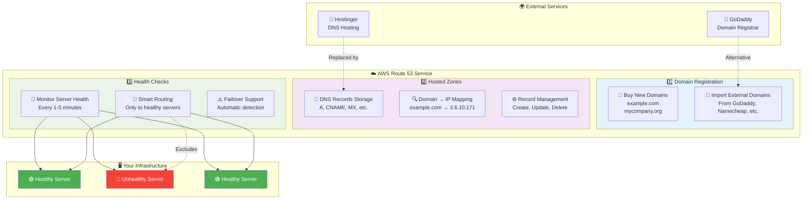

# Route 53 Core Services

## Three Essential Components

**Key Benefits**:
- **All-in-One Solution**: Replaces multiple external services
- **Intelligent Routing**: Only sends traffic to healthy servers  
- **Seamless Integration**: Works perfectly with other AWS services
- **Cost Effective**: No need for separate registrar and DNS hosting