# DNS Records in Hosted Zones

## Common DNS Record Types

```mermaid
flowchart TD
    subgraph Domain ["🌐 Domain: example.com"]
        subgraph Records ["📝 DNS Records in Hosted Zone"]
            A["📍 A Record<br/>example.com → 192.168.1.1<br/>(Domain to IPv4)"]
            AAAA["📍 AAAA Record<br/>example.com → 2001:db8::1<br/>(Domain to IPv6)"]
            CNAME["🔗 CNAME Record<br/>www.example.com → example.com<br/>(Alias to another domain)"]
            MX["📧 MX Record<br/>example.com → mail.example.com<br/>(Mail server routing)"]
            TXT["📄 TXT Record<br/>Domain verification<br/>SPF, DKIM records"]
            NS["🌐 NS Record<br/>example.com → ns1.route53.com<br/>(Name server delegation)"]
        end
    end
    
    subgraph Resolution ["🔍 DNS Resolution Process"]
        Query["❓ DNS Query<br/>What is example.com?"]
        Lookup["🔎 Route 53 Lookup<br/>Check hosted zone"]
        Response["✅ DNS Response<br/>192.168.1.1"]
    end
    
    Query --> Lookup
    Lookup --> Records
    Records --> Response
    
    style A fill:#e8f5e8
    style AAAA fill:#e3f2fd
    style CNAME fill:#fff3e0
    style MX fill:#fce4ec
    style TXT fill:#f3e5f5
    style NS fill:#e0f2f1
    
    classDef primary fill:#4caf50,color:white
    classDef secondary fill:#2196f3,color:white
    class A primary
    class Query,Lookup,Response secondary
```

**Record Types Explained**:
- **A Record**: Maps domain to IPv4 address (most common)
- **AAAA Record**: Maps domain to IPv6 address  
- **CNAME**: Creates alias (www.example.com → example.com)
- **MX Record**: Defines mail server for email routing
- **TXT Record**: Stores text data (verification, SPF records)
- **NS Record**: Delegates subdomain to other name servers