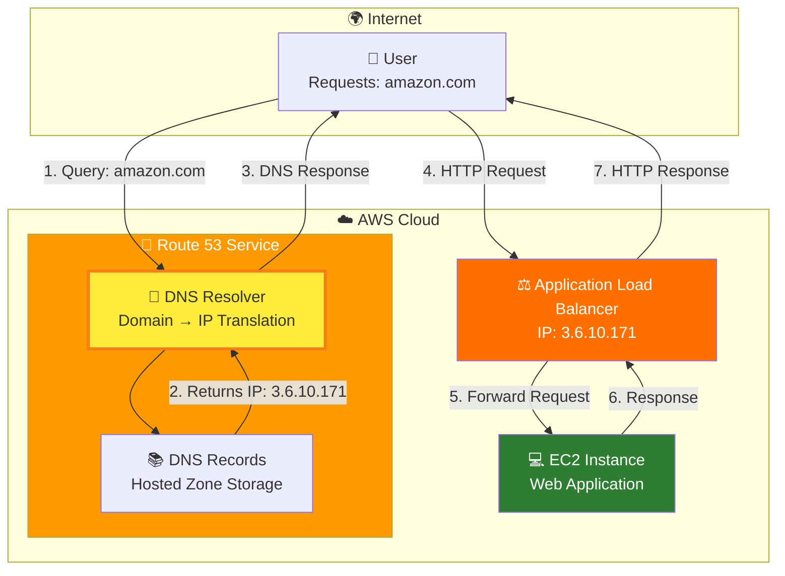

# AWS Route 53 Overview - Enhanced with AWS Icons

## DNS as a Service Architecture

```mermaid
architecture-beta
    group internet(cloud)[Internet]
    group aws_cloud(logos:aws)[AWS Cloud]
    group route53_service(logos:aws-route-53)[Route 53 Service]

    service user(logos:aws-lambda)[User] in internet
    service dns_resolver(logos:aws-route-53)[DNS Resolver] in route53_service
    service hosted_zone(database)[Hosted Zone] in route53_service
    service load_balancer(logos:aws-elastic-load-balancing)[Load Balancer] in aws_cloud
    service web_server(logos:aws-ec2)[Web Server] in aws_cloud

    user:R --> L:dns_resolver
    dns_resolver:R --> L:hosted_zone
    hosted_zone:R --> L:load_balancer
    load_balancer:R --> L:web_server
```

## Traditional Flowchart View

**AWS Route 53 Key Points**:
- **Service Type**: Managed DNS service (DNS as a Service)
- **Primary Function**: Resolves domain names to IP addresses
- **AWS Integration**: Native integration with all AWS services
- **Global Infrastructure**: Uses AWS edge locations worldwide
- **Pricing Model**: Pay-per-query with no upfront costs

**How it Replaces Traditional DNS**:
- Instead of managing DNS servers, use Route 53's managed service
- Replaces external DNS providers like GoDaddy DNS hosting
- Provides enterprise-grade reliability with 100% uptime SLA