# Route 53 Core Services - Complete AWS Integration

## Three Core Services Architecture

```mermaid
architecture-beta
    group route53_core(logos:aws-route-53)[Route 53 Core Services]
    group domain_registration(logos:aws-certificate-manager)[Domain Registration]
    group hosted_zones(database)[Hosted Zones]
    group health_checks(logos:aws-cloudwatch)[Health Checks]
    group external_services(cloud)[External Services]
    group aws_resources(logos:aws)[AWS Resources]

    service buy_domain(logos:aws-route-53)[Buy Domains] in domain_registration
    service import_domain(logos:aws-migration-hub)[Import Domains] in domain_registration
    service dns_records(database)[DNS Records] in hosted_zones
    service record_management(logos:aws-config)[Record Management] in hosted_zones
    service health_monitor(logos:aws-cloudwatch)[Health Monitor] in health_checks
    service failover(logos:aws-global-accelerator)[Failover Logic] in health_checks
    
    service godaddy(cloud)[GoDaddy] in external_services
    service namecheap(cloud)[Namecheap] in external_services
    service alb(logos:aws-elastic-load-balancing)[Load Balancer] in aws_resources
    service ec2(logos:aws-ec2)[EC2 Instances] in aws_resources
    service s3(logos:aws-s3)[S3 Website] in aws_resources

    godaddy:R --> L:import_domain
    namecheap:R --> L:import_domain
    dns_records:R --> L:alb
    health_monitor:R --> L:ec2
    failover:R --> L:s3
```

## Detailed Service Breakdown

```mermaid
flowchart TD
    subgraph R53Services ["☁️ Route 53 Services"]
        subgraph DomainReg ["1️⃣ Domain Registration"]
            A["🛒 Purchase New Domains<br/>• .com, .org, .net, .io<br/>• 300+ TLD options<br/>• Automatic DNS setup<br/>• AWS billing integration"]
            B["🔗 Import External Domains<br/>• Transfer from GoDaddy<br/>• Import from Namecheap<br/>• Update nameservers<br/>• Maintain existing domains"]
        end
        
        subgraph HostedZones ["2️⃣ Hosted Zones & DNS Records"]
            C["📝 DNS Record Types<br/>• A Records (IPv4)<br/>• AAAA Records (IPv6)<br/>• CNAME Records (Aliases)<br/>• MX Records (Email)<br/>• TXT Records (Verification)"]
            D["🎯 AWS Resource Integration<br/>• ALB/NLB endpoints<br/>• CloudFront distributions<br/>• S3 static websites<br/>• Elastic Beanstalk apps<br/>• API Gateway APIs"]
            E["⚙️ Advanced Routing<br/>• Weighted routing<br/>• Latency-based routing<br/>• Geolocation routing<br/>• Failover routing"]
        end
        
        subgraph HealthChecks ["3️⃣ Health Checks & Monitoring"]
            F["💓 Health Check Types<br/>• HTTP/HTTPS endpoints<br/>• TCP port checks<br/>• String matching<br/>• CloudWatch alarms<br/>• Calculated health checks"]
            G["🌍 Global Monitoring<br/>• 15+ global locations<br/>• 30-second intervals<br/>• Customizable thresholds<br/>• SNS notifications"]
            H["🔄 Automatic Failover<br/>• Primary/Secondary setup<br/>• Multi-region failover<br/>• Active-Active routing<br/>• Disaster recovery"]
        end
    end
    
    subgraph CompetitorServices ["🏪 Traditional DNS Providers"]
        GoDaddy["🏢 GoDaddy<br/>• Domain registration only<br/>• Basic DNS hosting<br/>• Manual configuration<br/>• No AWS integration"]
        Hostinger["🏢 Hostinger<br/>• DNS hosting service<br/>• Basic health checks<br/>• Limited automation<br/>• External monitoring needed"]
        Cloudflare["🏢 Cloudflare<br/>• DNS + CDN service<br/>• Good performance<br/>• Separate from AWS<br/>• Additional complexity"]
    end
    
    subgraph AWSTargets ["🎯 AWS Target Resources"]
        ALB["⚖️ Application Load Balancer<br/>• HTTP/HTTPS traffic<br/>• Multi-AZ distribution<br/>• Auto-scaling support"]
        NLB["⚖️ Network Load Balancer<br/>• TCP/UDP traffic<br/>• Ultra-low latency<br/>• Static IP addresses"]
        CF["🌐 CloudFront CDN<br/>• Global edge caching<br/>• HTTPS acceleration<br/>• Static/dynamic content"]
        S3["🪣 S3 Static Website<br/>• Static web hosting<br/>• Cost-effective<br/>• High availability"]
        EB["🚀 Elastic Beanstalk<br/>• Application platform<br/>• Easy deployment<br/>• Auto-scaling built-in"]
    end
    
    %% Connections showing Route 53 replaces multiple services
    GoDaddy -.->|"Replaced by"| A
    Hostinger -.->|"Replaced by"| C
    Cloudflare -.->|"Alternative to"| F
    
    %% Route 53 to AWS resources
    D --> ALB
    D --> NLB
    D --> CF
    D --> S3
    D --> EB
    
    %% Health checks to resources
    F --> ALB
    F --> NLB
    F --> S3
    F --> EB
    
    style DomainReg fill:#e3f2fd
    style HostedZones fill:#f3e5f5
    style HealthChecks fill:#e8f5e8
    style CompetitorServices fill:#ffebee
    style AWSTargets fill:#fff3e0
    
    classDef awsService fill:#ff9900,color:white
    classDef primaryTarget fill:#4caf50,color:white
    classDef competitor fill:#f44336,color:white
    
    class ALB,NLB,CF,S3,EB primaryTarget
    class A,C,F awsService
    class GoDaddy,Hostinger,Cloudflare competitor
```

**Cost Comparison (Monthly)**:

| Service | Traditional Setup | Route 53 |
|---------|------------------|-----------|
| Domain Registration | $10-15/year | $12/year |
| DNS Hosting | $5-20/month | $0.50/month |
| Health Monitoring | $10-50/month | $1-5/month |
| Global Performance | $20-100/month | Included |
| **Total Monthly** | **$35-170** | **$2-6** |

**Key Advantages of Route 53**:
- 🎯 **Native AWS Integration**: No complex API integrations needed
- 💰 **Cost Effective**: Consolidated billing and competitive pricing
- 🚀 **Performance**: Uses AWS global infrastructure
- 🔒 **Security**: IAM integration and AWS security standards
- 📊 **Monitoring**: Built-in CloudWatch metrics and logging