# Route 53 Health Checks & Failover - Advanced AWS Implementation

## AWS Health Check Architecture


## Intelligent Health Monitoring & Failover

```mermaid
flowchart TD
    subgraph Global ["🌍 Global Health Check Network"]
        subgraph Locations ["📍 AWS Health Check Locations (15+ Worldwide)"]
            Virginia["🇺🇸 N. Virginia<br/>us-east-1"]
            Oregon["🇺🇸 Oregon<br/>us-west-2"]
            Ireland["🇮🇪 Ireland<br/>eu-west-1"]
            Tokyo["🇯🇵 Tokyo<br/>ap-northeast-1"]
            Sydney["🇦🇺 Sydney<br/>ap-southeast-2"]
            More["➕ 10+ More<br/>Edge Locations"]
        end
    end
    
    subgraph HealthCheckTypes ["💓 Health Check Types"]
        HTTP["🌐 HTTP/HTTPS Endpoint<br/>• URL: https://api.myapp.com/health<br/>• Expected: 200 OK<br/>• Interval: 30 seconds<br/>• Failure threshold: 3 attempts"]
        
        TCP["🔌 TCP Port Check<br/>• Host: myapp.com<br/>• Port: 443 (HTTPS)<br/>• Timeout: 10 seconds<br/>• Success: Connection established"]
        
        StringMatch["🔍 String Matching<br/>• Search for: 'Status: OK'<br/>• In response body<br/>• Case sensitive option<br/>• Regex support available"]
        
        Calculated["📊 Calculated Health Check<br/>• Combine multiple checks<br/>• Boolean logic (AND/OR)<br/>• Complex failover scenarios<br/>• Weighted decisions"]
        
        CloudWatch["📈 CloudWatch Alarm<br/>• Monitor AWS metrics<br/>• CPU, memory, disk usage<br/>• Custom application metrics<br/>• Threshold-based alerts"]
    end
    
    subgraph MultiRegionSetup ["🌐 Multi-Region Failover Setup"]
        subgraph Primary ["🟢 Primary Region (us-east-1)"]
            ALB1["⚖️ Application Load Balancer<br/>Status: ✅ Healthy<br/>Health Score: 100%<br/>Response Time: 50ms"]
            App1["💻 EC2 Auto Scaling Group<br/>Instances: 3/3 healthy<br/>CPU: 45%<br/>Memory: 60%"]
            RDS1["🗄️ RDS Primary<br/>Status: ✅ Available<br/>Connections: 85/100<br/>Read Replicas: 2"]
        end
        
        subgraph Secondary ["🟡 Secondary Region (us-west-2)"]
            ALB2["⚖️ Application Load Balancer<br/>Status: ✅ Standby<br/>Health Score: 100%<br/>Response Time: 75ms"]
            App2["💻 EC2 Auto Scaling Group<br/>Instances: 2/2 healthy<br/>CPU: 20%<br/>Memory: 30%"]
            RDS2["🗄️ RDS Read Replica<br/>Status: ✅ Available<br/>Lag: < 1 second<br/>Promote ready: Yes"]
        end
    end
    
    subgraph FailoverLogic ["🎯 Route 53 Failover Logic"]
        Decision{"🤔 Health Assessment<br/>Primary Region Status?"}
        DNSUpdate["🔄 DNS Record Update<br/>TTL: 60 seconds<br/>Propagation: < 1 minute"]
        UserTraffic["👥 User Traffic Routing<br/>Automatic redirection"]
    end
    
    subgraph Monitoring ["📊 Monitoring & Alerts"]
        SNS["📧 SNS Notifications<br/>• Email alerts<br/>• SMS notifications<br/>• Slack integration<br/>• PagerDuty integration"]
        
        CW["📈 CloudWatch Dashboard<br/>• Health check metrics<br/>• DNS query patterns<br/>• Failover events<br/>• Performance metrics"]
        
        Logs["📝 Route 53 Query Logs<br/>• DNS query details<br/>• Response codes<br/>• Query sources<br/>• Performance analysis"]
    end
    
    %% Health Check Flow
    Virginia --> HTTP
    Oregon --> TCP
    Ireland --> StringMatch
    Tokyo --> Calculated
    Sydney --> CloudWatch
    
    %% Resource Monitoring
    HTTP --> ALB1
    TCP --> ALB1
    StringMatch --> App1
    CloudWatch --> RDS1
    
    %% Failover Decision Process
    ALB1 -->|"Health Status"| Decision
    App1 -->|"Health Status"| Decision
    RDS1 -->|"Health Status"| Decision
    
    Decision -->|"✅ Healthy"| ALB1
    Decision -->|"❌ Unhealthy"| DNSUpdate
    DNSUpdate --> ALB2
    DNSUpdate --> UserTraffic
    
    %% Monitoring Integration
    Decision --> SNS
    DNSUpdate --> CW
    ALB1 --> Logs
    ALB2 --> Logs
    
    style Primary fill:#e8f5e8
    style Secondary fill:#fff3e0
    style HealthCheckTypes fill:#e3f2fd
    style FailoverLogic fill:#f3e5f5
    style Monitoring fill:#fce4ec
    
    classDef healthy fill:#4caf50,color:white
    classDef standby fill:#ff9800,color:white
    classDef monitoring fill:#2196f3,color:white
    classDef critical fill:#f44336,color:white
    
    class ALB1,App1,RDS1 healthy
    class ALB2,App2,RDS2 standby
    class HTTP,TCP,StringMatch,CW monitoring
```



## Advanced Health Check Scenarios

```mermaid
flowchart LR
    subgraph Scenarios ["🎭 Real-World Failover Scenarios"]
        subgraph Scenario1 ["Scenario 1: Database Failure"]
            S1_Event["💥 Primary RDS Failure<br/>Connection timeout"]
            S1_Detection["⚠️ Health Check Detects<br/>HTTP 500 responses"]
            S1_Action["🔄 Route to Secondary<br/>Promote read replica"]
            S1_Recovery["✅ Automatic Recovery<br/>DNS points back when fixed"]
            
            S1_Event --> S1_Detection --> S1_Action --> S1_Recovery
        end
        
        subgraph Scenario2 ["Scenario 2: Region Outage"]
            S2_Event["🌪️ Entire Region Down<br/>Network partitioning"]
            S2_Detection["📍 Multiple Health Checks Fail<br/>Global monitoring alerts"]
            S2_Action["🌐 Traffic to Backup Region<br/>Full disaster recovery"]
            S2_Recovery["🔙 Gradual Traffic Return<br/>Weighted routing back"]
            
            S2_Event --> S2_Detection --> S2_Action --> S2_Recovery
        end
        
        subgraph Scenario3 ["Scenario 3: Performance Degradation"]
            S3_Event["🐌 High Response Times<br/>Performance below SLA"]
            S3_Detection["📊 CloudWatch Alarms<br/>Latency thresholds exceeded"]
            S3_Action["⚖️ Traffic Distribution<br/>Weighted routing adjustment"]
            S3_Recovery["📈 Performance Monitoring<br/>Gradual traffic restoration"]
            
            S3_Event --> S3_Detection --> S3_Action --> S3_Recovery
        end
    end
```



**Route 53 Health Check Configuration Examples**:

### 🌐 HTTP Health Check
```json
{
  "Type": "HTTP",
  "ResourcePath": "/health",
  "FullyQualifiedDomainName": "api.myapp.com",
  "Port": 80,
  "RequestInterval": 30,
  "FailureThreshold": 3,
  "SearchString": "Status: OK"
}
```

### 🔍 Advanced Monitoring Features
- **Request Interval**: 10 or 30 seconds (fast or standard)
- **Failure Threshold**: 1-10 consecutive failures before marking unhealthy
- **Health Check Locations**: Choose specific regions or use all available
- **String Matching**: Search for specific text in HTTP responses
- **Latency Measurements**: Track response times from different locations

### 💰 Cost Optimization
- **Basic Health Checks**: $0.50/month per health check
- **Fast Health Checks**: $1.00/month per health check (10-second intervals)
- **Calculated Health Checks**: $1.00/month (combines multiple checks)
- **Health Check Locations**: Free to use all available locations

### 🎯 Best Practices
1. **Multiple Checks**: Use different health check types for comprehensive monitoring
2. **Regional Distribution**: Ensure health checks from multiple geographic locations
3. **Appropriate TTL**: Set DNS TTL to balance performance vs. failover speed
4. **Gradual Failback**: Use weighted routing for gradual traffic restoration
5. **Monitoring Integration**: Connect to CloudWatch and SNS for complete observability