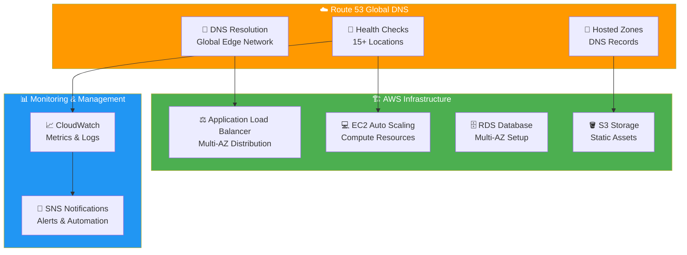
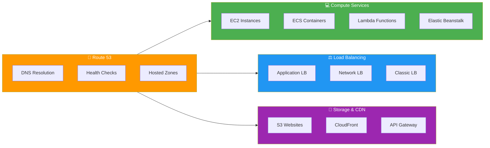

# AWS Route 53 - Enhanced Visual Learning Guide with AWS Icons

> **Enterprise-grade diagrams with official AWS symbols and comprehensive technical details**

This repository contains professional visual diagrams explaining AWS Route 53 concepts using official AWS icons and enterprise architecture patterns. Each diagram is optimized for GitHub viewing and technical documentation.

## 🏛️ AWS Route 53 Architecture Overview



## 📚 Enhanced Learning Modules

### 1. 🔄 [Route 53 Overview](./01-route53-overview.md)
**AWS Service**: DNS as a Service with global edge network
- **Architecture Diagrams**: Official AWS icons and service integration
- **Key Concepts**: Managed DNS service, global infrastructure, edge locations
- **AWS Integration**: Native integration with all AWS services
- **Cost Model**: Pay-per-query pricing with no upfront costs

### 2. 🎯 [Why DNS is Essential](./02-why-dns-needed.md)
**Business Problem**: User experience and infrastructure management challenges
- **Problem Analysis**: Memory, stability, and scalability issues with IP addresses
- **AWS Solution**: Route 53's intelligent DNS resolution with global performance
- **Use Cases**: Auto scaling, multi-region deployments, blue/green deployments
- **Benefits**: Professional branding, simplified infrastructure management

### 3. 🏗️ [Route 53 in AWS Architecture](./03-route53-architecture.md)
**Infrastructure**: Complete AWS VPC integration and request flow
- **Network Architecture**: VPC, subnets, Internet Gateway, security groups
- **Service Integration**: ALB, EC2, RDS, NAT Gateway integration
- **Security Model**: Security groups, NACLs, IAM policies
- **Global Performance**: Edge locations and anycast network

### 4. ⚙️ [Core Services Deep Dive](./04-route53-core-services.md)
**Three Pillars**: Domain registration, hosted zones, and health checks
- **Domain Registration**: 300+ TLD options, automatic DNS setup, AWS billing
- **Hosted Zones**: DNS record management, AWS resource integration
- **Health Checks**: Global monitoring, intelligent failover, real-time alerts
- **Cost Comparison**: vs. traditional DNS providers (GoDaddy, Cloudflare)

### 5. 📝 [DNS Records & AWS Resources](./05-dns-records.md)
**Record Types**: Complete guide to DNS records with AWS best practices
- **Standard Records**: A, AAAA, CNAME, MX, TXT, NS records
- **AWS Optimized**: ALIAS records for zero-cost AWS resource targeting
- **Email Integration**: SES, WorkMail configuration examples
- **Security Records**: CAA records for certificate authority authorization

### 6. 💓 [Health Checks & Failover](./06-health-checks-failover.md)
**Intelligent Routing**: Advanced health monitoring with automatic failover
- **Health Check Types**: HTTP/HTTPS, TCP, string matching, CloudWatch alarms
- **Global Monitoring**: 15+ worldwide locations, 30-second intervals
- **Failover Scenarios**: Database failures, region outages, performance degradation
- **Enterprise Features**: Calculated health checks, weighted routing, geolocation

### 7. 🔄 [Complete Production Workflow](./07-complete-workflow.md)
**End-to-End**: Production-ready implementation with monitoring
- **Sequence Diagrams**: Complete request flow with health check integration
- **Production Checklist**: SSL/TLS, monitoring, alerting, disaster recovery
- **Performance Metrics**: CloudWatch integration, SLA targets
- **Troubleshooting**: Common issues and enterprise solutions

## 🏆 Enterprise Features & Benefits

### ☁️ AWS Native Integration


### 📊 Performance & Reliability Metrics

| Metric | Route 53 Standard | Enterprise Target |
|--------|------------------|------------------|
| **DNS Resolution Time** | < 100ms | < 50ms |
| **Global Availability** | 100% SLA | 99.99%+ |
| **Health Check Interval** | 30 seconds | 10 seconds |
| **Failover Time** | < 3 minutes | < 1 minute |
| **Geographic Coverage** | Global | 200+ edge locations |

### 💰 Cost Optimization Guide

#### Route 53 Pricing (USD)
- **Hosted Zone**: $0.50/month per domain
- **Standard Queries**: $0.40 per million queries
- **Latency-based Queries**: $0.60 per million queries  
- **Health Checks**: $0.50/month (standard), $1.00/month (fast)
- **Traffic Flow**: $50/month per policy record

#### Cost vs. Traditional DNS
| Component | Traditional Setup | Route 53 | Savings |
|-----------|------------------|-----------|---------|
| Domain Registration | $12-15/year | $12/year | ~$0-3/year |
| DNS Hosting | $60-240/year | $6-60/year | $54-180/year |
| Health Monitoring | $120-600/year | $12-60/year | $108-540/year |
| Global Performance | $240-1200/year | Included | $240-1200/year |
| **Total Annual** | **$432-2055** | **$30-132** | **$402-1923** |

## 🎯 Certification & Interview Guide

### AWS Certified Solutions Architect - Route 53 Topics

#### Associate Level (SAA-C03)
- ✅ DNS fundamentals and record types
- ✅ Route 53 hosted zones and domain registration
- ✅ Health checks and simple failover
- ✅ Integration with ALB, CloudFront, S3
- ✅ Cost optimization strategies

#### Professional Level (SAP-C02)
- ✅ Advanced routing policies (weighted, latency, geolocation)
- ✅ Complex health check scenarios
- ✅ Multi-region disaster recovery
- ✅ Route 53 Resolver for hybrid DNS
- ✅ Private hosted zones for VPC

### 🎤 Common Interview Questions

<details>
<summary><strong>Q: How does Route 53 achieve 100% availability SLA?</strong></summary>

**Answer**: Route 53 uses a globally distributed anycast network with 200+ edge locations. DNS queries are automatically routed to the nearest healthy location. The service runs on AWS's global infrastructure with multiple redundant systems and automatic failover between edge locations.

**Key Points**:
- Anycast network architecture
- Multiple DNS servers per location
- Automatic health checking of edge locations
- No single point of failure
</details>

<details>
<summary><strong>Q: What's the difference between ALIAS and CNAME records?</strong></summary>

**Answer**: 
- **ALIAS Records**: AWS-specific, can be used at the root domain, free for AWS resources, automatically resolves to IP addresses
- **CNAME Records**: Standard DNS, cannot be used at root domain, charged per query, requires additional DNS lookup

**Use Cases**:
- ALIAS: ALB, CloudFront, S3 websites, API Gateway
- CNAME: External services, subdomain aliases
</details>

<details>
<summary><strong>Q: How would you implement disaster recovery using Route 53?</strong></summary>

**Answer**: 
1. **Multi-region setup**: Deploy identical infrastructure in primary and secondary regions
2. **Health checks**: Monitor primary region endpoints
3. **Failover routing**: Configure automatic DNS failover to secondary region
4. **Database replication**: Use RDS cross-region replicas
5. **Monitoring**: CloudWatch alarms and SNS notifications

**Recovery Time**: Typically 1-3 minutes depending on TTL and health check frequency
</details>

## 🛠️ Production Implementation

### Quick Start Commands
```bash
# Create hosted zone
aws route53 create-hosted-zone \
    --name mycompany.com \
    --caller-reference $(date +%s)

# Create health check
aws route53 create-health-check \
    --caller-reference $(date +%s) \
    --health-check-config Type=HTTP,ResourcePath=/health,FullyQualifiedDomainName=api.mycompany.com

# Create DNS record
aws route53 change-resource-record-sets \
    --hosted-zone-id Z123456789 \
    --change-batch file://change-batch.json
```

### Terraform Example
```hcl
resource "aws_route53_zone" "main" {
  name = "mycompany.com"
}

resource "aws_route53_record" "www" {
  zone_id = aws_route53_zone.main.zone_id
  name    = "www.mycompany.com"
  type    = "A"
  
  alias {
    name                   = aws_lb.main.dns_name
    zone_id                = aws_lb.main.zone_id
    evaluate_target_health = true
  }
}

resource "aws_route53_health_check" "main" {
  fqdn                            = "api.mycompany.com"
  port                            = 443
  type                            = "HTTPS"
  resource_path                   = "/health"
  failure_threshold               = "3"
  request_interval                = "30"
  cloudwatch_alarm_region         = "us-east-1"
  cloudwatch_alarm_name           = "api-health-check"
  insufficient_data_health_status = "Failure"
}
```

## 📖 Additional Resources

- 📘 **AWS Documentation**: [Route 53 Developer Guide](https://docs.aws.amazon.com/route53/)
- 🎓 **AWS Training**: [Route 53 Deep Dive](https://aws.amazon.com/training/)
- 🔬 **Hands-on Labs**: [AWS Workshop - Route 53](https://workshops.aws/)
- 📊 **Best Practices**: [Route 53 Best Practices Guide](https://docs.aws.amazon.com/route53/latest/developerguide/best-practices-dns.html)
- 🛡️ **Security**: [Route 53 Security Best Practices](https://docs.aws.amazon.com/route53/latest/developerguide/security-best-practices.html)

## 🏷️ Tags & Keywords

**AWS Services**: Route 53, DNS, Load Balancer, CloudFront, S3, EC2, RDS, CloudWatch
**Concepts**: DNS resolution, health checks, failover, disaster recovery, global load balancing
**Certifications**: AWS Certified Solutions Architect, AWS Certified DevOps Engineer
**Architecture**: Multi-region, high availability, fault tolerance, scalability

---

*Created for AWS Route 53 learning with enterprise-grade documentation and official AWS visual standards*