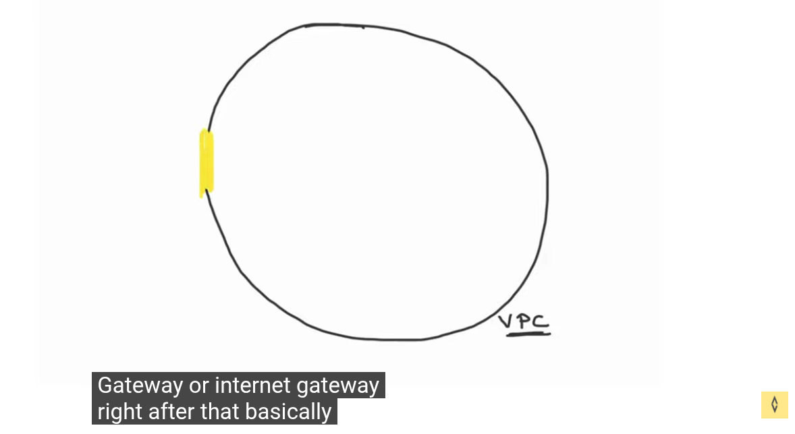
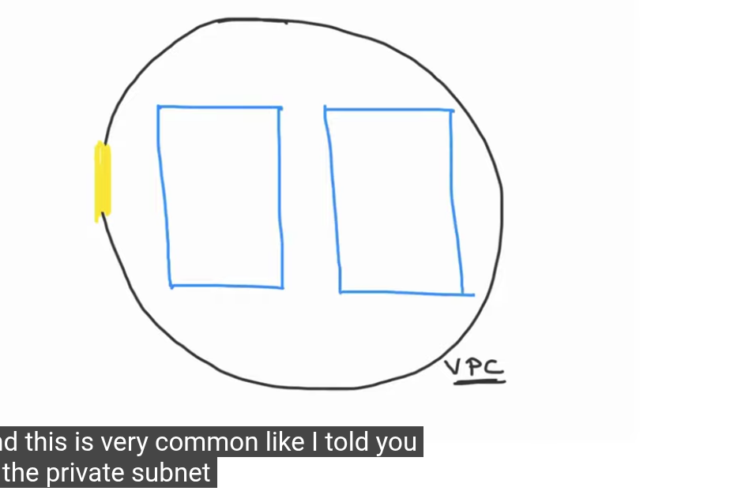
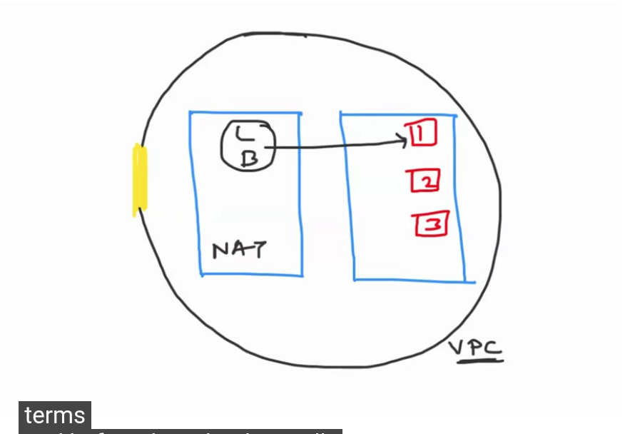
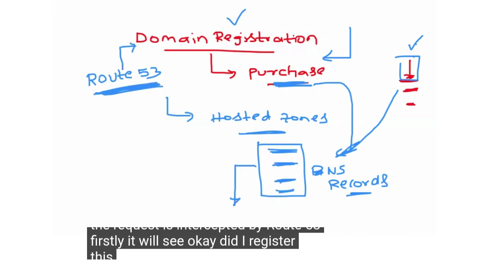
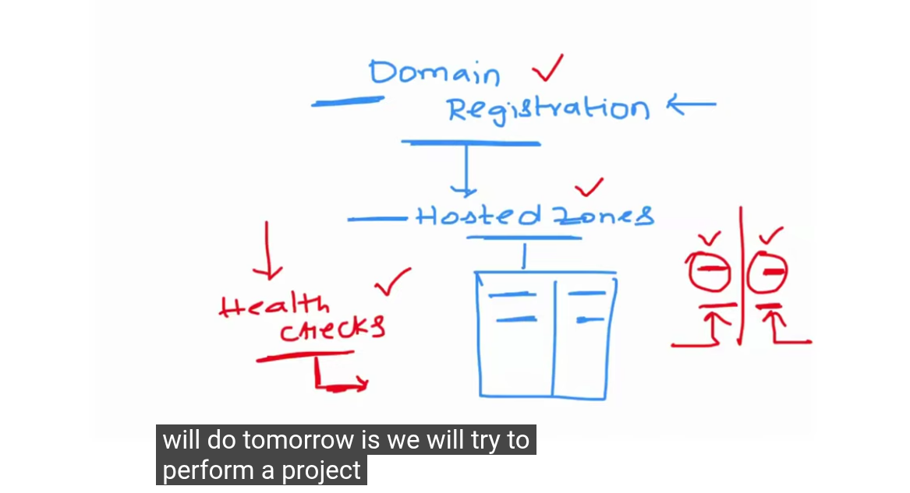

Day-6 | Route53

with in VPC

Internet Gateway(Ingress)->

 

Public subnet having Load Balancer, Nat Gateway

1. names can be easy to remember
2. ip address are hard to remember, and can change , they can be static or dynamic;

What is dns- lot of records

